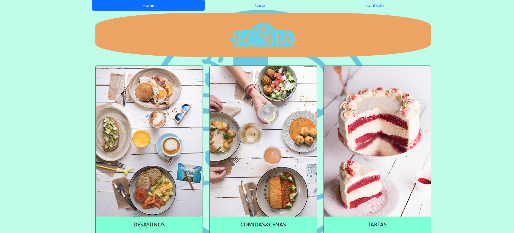

## Proyecto 1 - Carta de Restaurante Digial

Es una carta de restaurante digital, la temática era libre y yo he escogido hacer un proyecto sobre el restaurante "La Mas Bonita" porque es un restaurante que me gusta y lo que he hecho ha sido hacerlo yo intentando en la medida de lo posible respetar un poco esos colores pasteles que lo caracterizan y utilizando imagenes de su página web.

## Cuenta con una barra de menú:
La barra de menú consta de 3 botones diferentes (Home, Carta y Contacto) los cuales están hipervinculados a sus respectivas páginas html.

## La carta:
En la carta he separado los platos en tres apartados diferentes (Desayunos, Comidas&Cenas y Tartas) para presentar lo que creo que es lo más destacado de este restaurante.
He puesto cuatro platos de cada apartado diferente con sus respectivas fotos, una descripción y su precio.

## Contacto:
En el apartado de contacto he querido poner un formulario, la información del local, la ubicación y la dirección a mi repositorio den GitHub.

## Tecnologías:
Las tecnologías que he utilizado han sido:
-HTML5.
-CSS3.
-CSS Layout.
-Bootstrap.

## Para ver el resultado:
Solo tienes que visitar: https://github.com/Chichonicle/Proyecto1/tree/master
